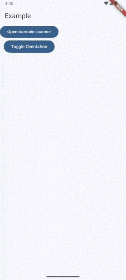

# Flutter QR Rectangle Detector for Google's ML Kit Barcode Scanning

A Flutter package to create a QR Rectangle Detector for Google's ML Kit Barcode Scanning. It will be useful for your awesome app.

More packages by [Romantic Developer](https://pub.dev/publishers/romanticdeveloper.com/packages)



### Example

```dart
import 'package:flutter/material.dart';
import 'package:flutter_animated_qr_scanner/flutter_animated_qr_scanner.dart';

void main() => runApp(MyApp());

class MyApp extends StatefulWidget {
  @override
  _MyAppState createState() => _MyAppState();
}

class _MyAppState extends State<MyApp> {
  @override
  Widget build(BuildContext context) {
    return MaterialApp(
      title: 'Example',
      theme: ThemeData(
        primarySwatch: Colors.blue,
      ),
      home: Home(),
    );
  }
}

class Home extends StatefulWidget {
  const Home({Key? key}) : super(key: key);

  @override
  State<Home> createState() => _HomeState();
}

class _HomeState extends State<Home> {
  
  @override
  Widget build(BuildContext context) {
    return Scaffold(
      appBar: AppBar(
        title: Text('Romantic Developer'),
      ),
      body: SafeArea(
        child: SingleChildScrollView(
          padding: const EdgeInsets.all(20.0),
          child: Column(
            crossAxisAlignment: CrossAxisAlignment.stretch,
            children: [
                AnimatedBouncingText(
                  text: 'I am\nRomantic Developer.',
                  mode: BouncingTextModes.sequenceOneTime,
                  textAlign: TextAlign.center,
                  characterDuration: const Duration(seconds: 1),
                  characterDelay: const Duration(milliseconds: 300),
                  textStyle: TextStyle(
                    color: Colors.white,
                    fontWeight: FontWeight.bold,
                    fontSize: 22,
                  ),
                  onEnd: () {
                    print('_HomeState.build.onEnd.$index');
                  },
                ),
            ],
          ),
        ),
      ),
    );
  }
}

```